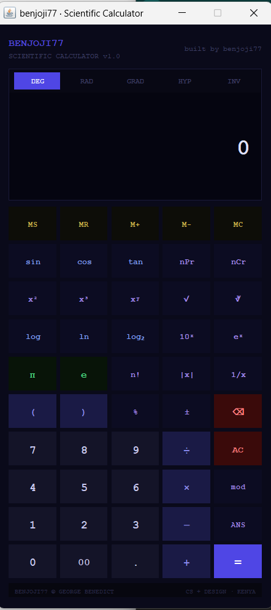

# 🧮 Scientific Calculator

A feature-rich scientific calculator built with Java Swing.



## ✨ Features
- Trigonometric functions (sin, cos, tan + inverses)
- Hyperbolic functions (sinh, cosh, tanh + inverses)
- Memory functions (MS, MR, M+, M-, MC)
- DEG / RAD / GRAD angle modes
- Factorial, logarithms, powers, nPr, nCr
- Answer memory (ANS) and history display
- Clean dark themed UI

## 🚀 How to Run
Make sure you have Java installed, then:
```bash
javac ScientificCalculator.java
java ScientificCalculator
```

## 🛠️ Built With
- Java
- Java Swing

## 👨‍💻 Author
**benjoji77** — George Benedict  
CS Student · Kenya 🇰🇪

## 📄 License
This project is open source and free to use.
